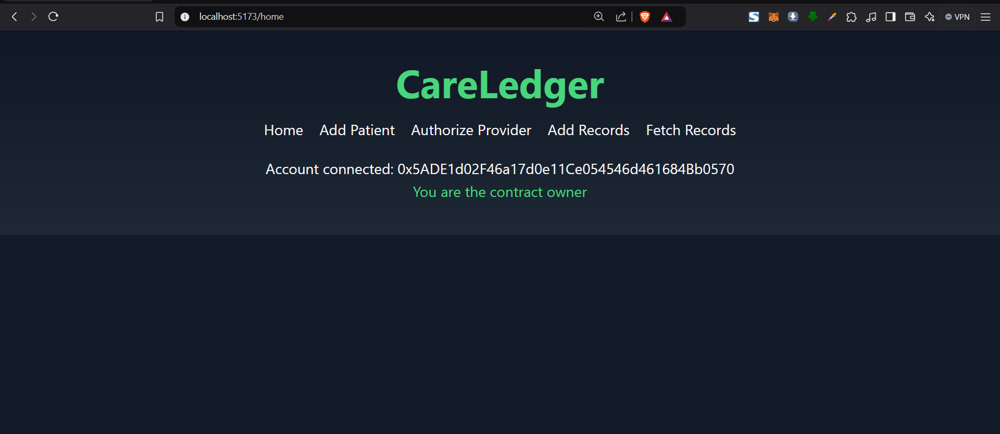
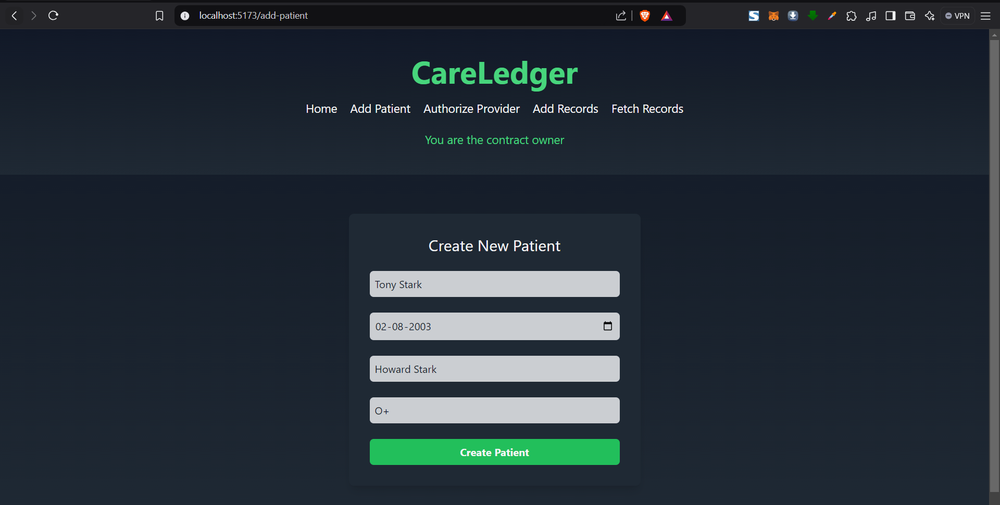
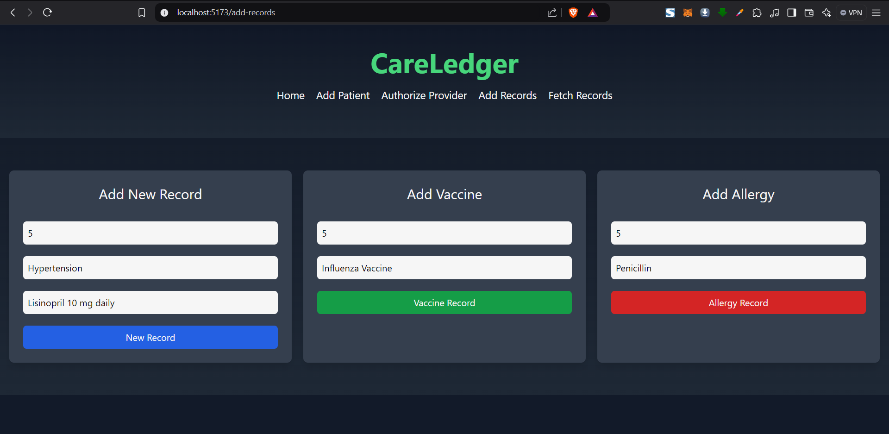
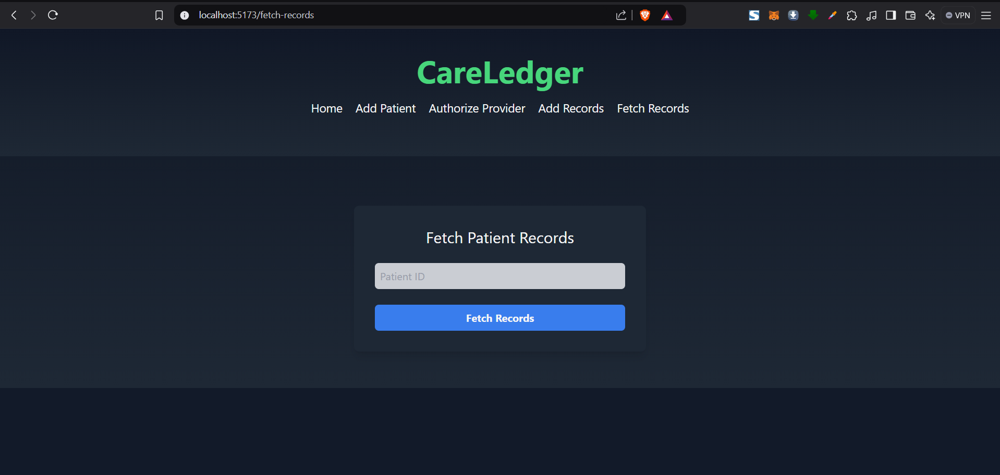
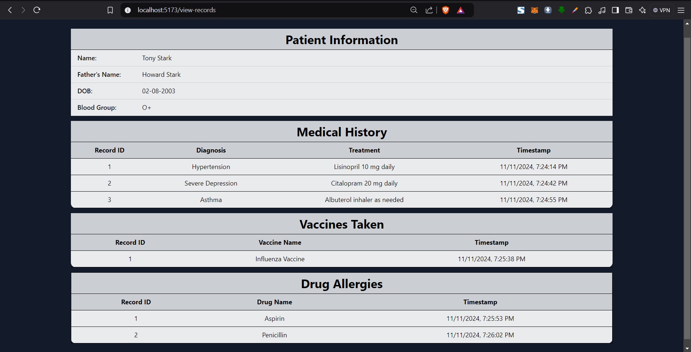

# CareLedger

**CareLedger** is a blockchain-based healthcare management solution focused on simplifying patient record management, ensuring privacy, and enhancing collaboration across healthcare providers.

## Overview

CareLedger leverages blockchain to create an immutable, accessible, and secure system for storing and sharing patient records. Built using React on the frontend and Solidity for smart contract functionality, CareLedger addresses the limitations of traditional healthcare data management by implementing a decentralized structure. This approach helps avoid data breaches, maintains transparency, and allows only authorized healthcare providers to access sensitive patient records.

## Problem Solved

In today’s healthcare landscape, managing patient records securely and efficiently is critical. Traditional systems often face challenges such as:

- **Data Breach Risks**: Centralized databases are vulnerable to hacking and unauthorized access.
- **Lack of Ownership**: Patients rarely have control or visibility over who accesses their medical history.
- **Inefficient Data Sharing**: Collaborating between healthcare providers can be slow and cumbersome due to data silos.

CareLedger addresses these issues with a blockchain foundation, ensuring each patient's medical record is safe, accessible, and under their control.

## Key Features

- **Patient Record Management**: Store, retrieve, and manage records securely on the blockchain.
- **Provider Authorization**: Healthcare providers can be authorized directly by the patient or system administrator to view and update medical records.
- **Efficient Role Management**: Easily manage roles for patients, providers, and admins.
- **Vaccine and Allergy Tracking**: Keep a record of allergies and vaccinations, integrated into patient records.

## Architecture Flow

1. **Frontend (React)**: Built with React, featuring dynamic pages for patient, provider, and record management, providing a clean, intuitive UI for smooth interactions.
2. **Smart Contract (Solidity)**: All medical records and patient data are stored on the blockchain, ensuring transparency and security. The smart contract defines data access rules and authorization functionalities.
3. **Ganache**: For local development and testing, the smart contract is deployed on Ganache, enabling a controlled blockchain environment.

## Future Enhancements

- **Scalability**: Transitioning from Ganache to mainnet for real-world application.
- **Data Analytics**: Enable providers to run analytics on patient data while preserving privacy.
- **Mobile Accessibility**: Develop a cross-platform mobile app to widen accessibility.

CareLedger is a solution focused on trust and control, providing a path toward a more collaborative and secure healthcare system for both patients and providers.

## Snapshots of working application

